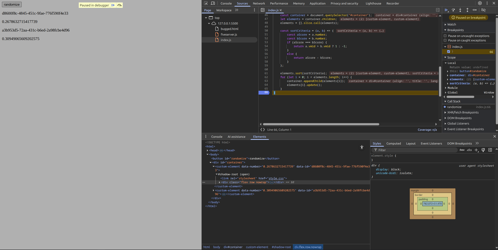

# Possible Chrome Bug?

This small repo is to document a possible bug in the Chrome/Chromium DOM parsing and/or rendering pipeline. It relates to the dynamic updating of custom elements and missing styling applied via the class attribute. 

## Overview

In the project, we have two custom elements which store 2 values (a number and a hex ID) inside a flexbox div. There is also a button which calls `randomize()` and randomizes the number and ID properties. It then sorts the list of custom elements by their number properties. This is to simulate fetching some data and rebuilding custom elements on the page from some backend source. The logic for the randomization and custom element can be found in `index.js`.

In the `bugged.html`, each custom element loads the `style.css` file using a link tag. This initially appears to have no issues as expected. However, clicking the randomize button, we see a slight flickering with both custom elements. Adding a breakpoint to `index.js:65` reveals that the stlyes defined in `style.css` are not being applied to the div. Inspect element also reveals that the stlyle is simply being treated as though it does not exist. A screen shot is shown below. Even though the div still has the classes `flex row nowrap` none of the relevant styles are applied according to the inspect element.

The "fix" is to statically include the relevant styles directly in the custom element. In `correct.html`, we can see that there is no flicker whatsoever with the randomization. Again, the only change was to move the source of the stlye from an external file to statically declared in the custom element.

## Why is this a bug?

It's possible that this is not a bug, and that this is working as intended. However, firefox does not have this issue at all. Loading either `bugged.html` or `correct.html` have exactly the same, non-flickering outcome.